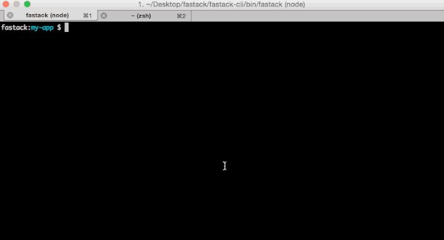

# Fastack 
Fastack is a zero-configuration development tool that makes developing client-side-only apps easy. Run `$ fastack` in your app directory to automatically enable the following features.

## Features
### Easy module loading
- Every file in your app directory is implicitly loaded into your Fastack application. Just drop `main.coffee`, `styles.sass` or `my-code.js` somewhere into your app directory and Fastack will load it.
- Need to install a dependency? `fastack:my-app $ install jquery` will install modules from JSPM




### Pre-compiler support
- SASS
- CoffeeScript


## Quickstart
```
$ npm install -g fastack
```

Fastack is an immersive command line application. Running `$ fastack` will drop you into a new prompt with a number of sub-commands available. Run `help` in the Fastack prompt for more information.

```
$ mkdir my-app
$ cd my-app
$ fastack
fastack:my-app $ init
```

